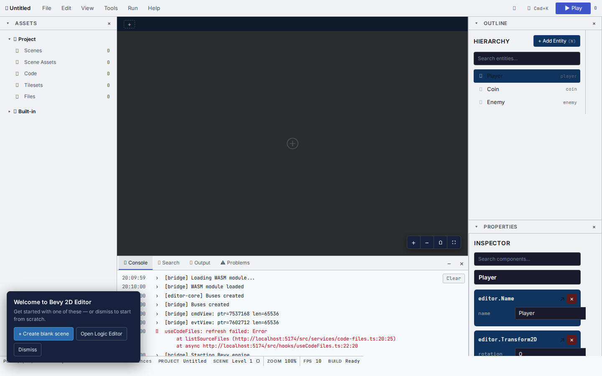
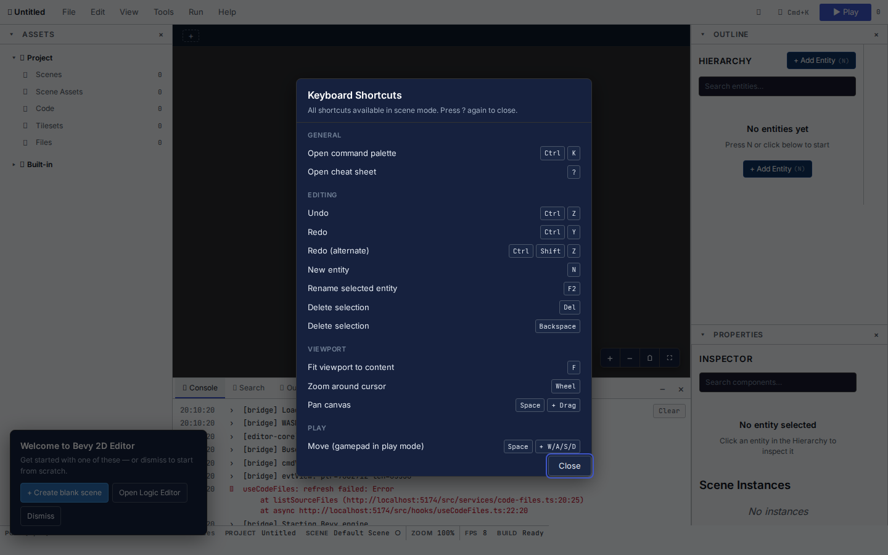
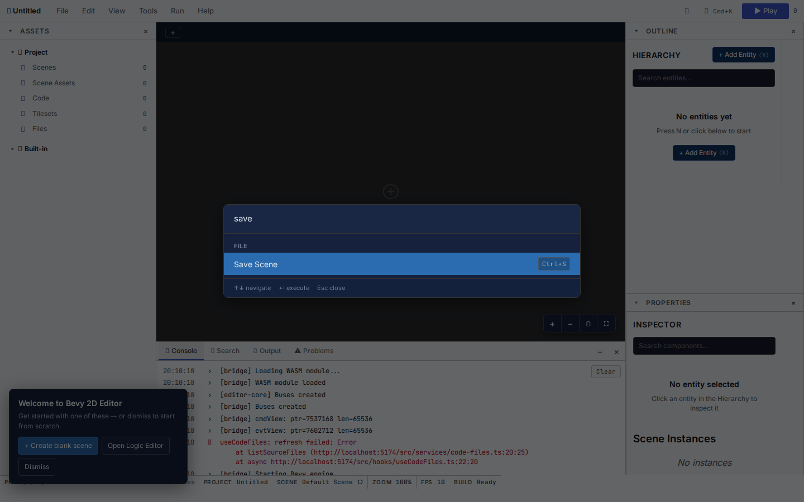
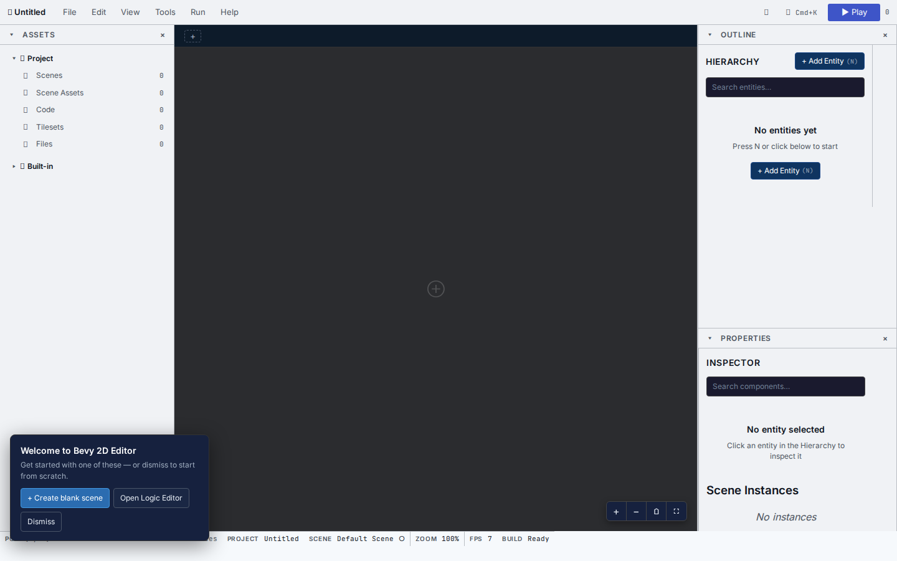
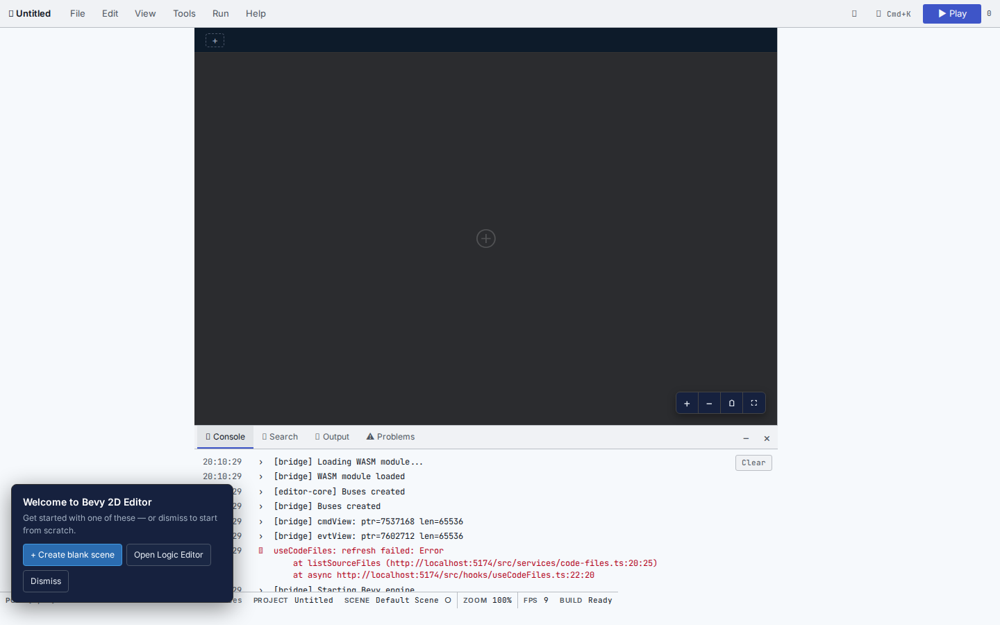
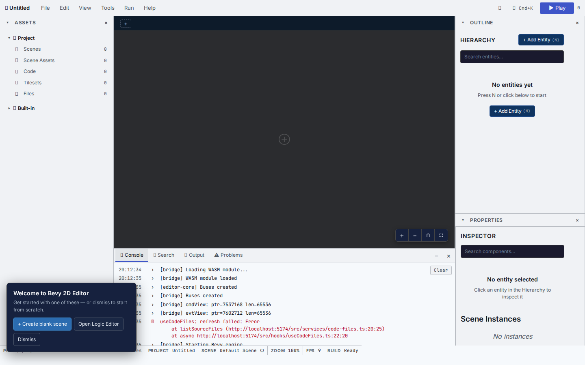
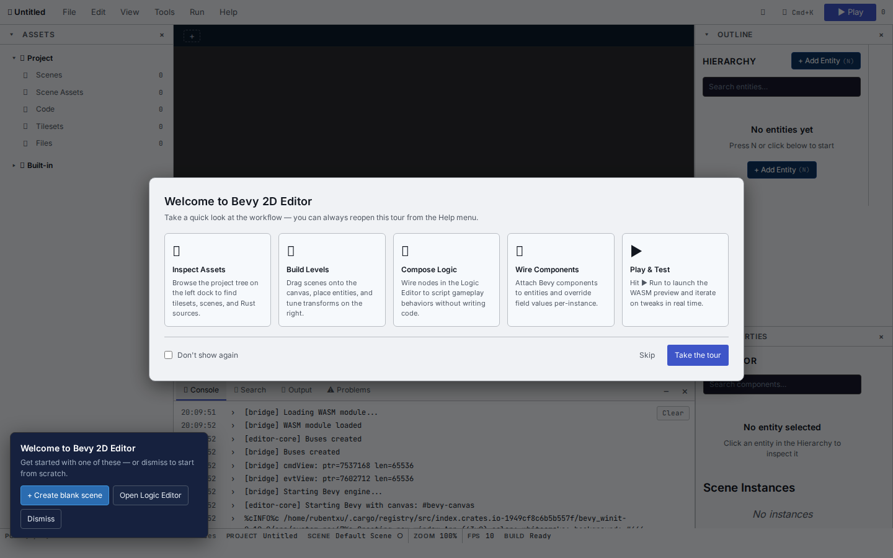

# Bevy 2D Editor User Guide

> **Layout**: Defold-inspired 3-region dock + menu bar + status bar (v0.81.0).
> See [`docs/adr/0021-defold-inspired-layout.md`](docs/adr/0021-defold-inspired-layout.md) for the full design rationale. v0.81 adds global search, workspace presets, drag-and-dock infrastructure, and per-panel state persistence.


## Place a sprite in 60 seconds



1. Complete the [README quickstart](README.md#quickstart) and open <http://localhost:5173>.
2. Dismiss the Welcome overlay (or check "Don't show again").
3. Press `N` (or click **+ Add Entity** in the Hierarchy panel) to create a new entity.
4. Select the entity. In the **Properties** panel (right dock), click **+ Add Component** and add:
   - `editor.Transform2D` — position/rotation/scale
   - `editor.Sprite2D` — color, anchor
5. Adjust the values in the Properties panel.
6. Press **Play** in the menu bar (or `Ctrl+P`) to run the scene. Press again to stop.
7. **File ▸ Save Scene** (or `Ctrl+S`) to save to OPFS.

## The layout (Defold-inspired)

The editor follows the same spatial layout as Defold/Unity/Construct:

```
┌──────────────────────────────────────────────────────────────────────────────────────────────┐
│ 🎮 ProjectName │ File  Edit  View  Tools  Run  Help                  [☀] [🔍] [▶ Play]           │ ← Menu bar
├──────────┬───────────────────────────────────────────────┬─────────────────────────────┤
│          │  SceneTabs [Level1] [Level2]                 │   Outline                    │
│  Assets  │  ┌─────────────────────────────────────────┐  │   🔍 Search                  │
│ (left)   │  │                                         │  │   ▾ 🌳 World                │ ← 3-region dock
│          │  │              Scene Viewport             │  │     ▸ Hero                  │   (drag-resizable
│          │  │                                         │  ├─────────────────────────────┤    dividers,
│          │  │                                         │  │   Properties                 │    OPFS persisted)
│          │  │                       ⊕  + − ⌂ ⛶        │  │   🔍 Search                  │
├──────────┼───────────────────────────────────────────────┤                             │
│   Tools  │ 📋 Console  🔍 Search  📤 Output  ⚠ Problems  │                             │ ← F7 toggles
│ (bottom) │ [12:34:56] Loading WASM module...            │                             │
├──────────┴───────────────────────────────────────────────┴─────────────────────────────┤
│ (120.5, 80.0) │ 3 entities │ ProjectName │ Level1●dirty │ 100% │ 60 fps │ ✓ Built │   │ ← 7-segment status bar
└──────────────────────────────────────────────────────────────────────────────────────────────┘
   F6=toggle Assets    F7=toggle Tools    F8=toggle Outline    Shift+F8=toggle Properties    F9=fullscreen
```

### Region guide

| Region | Contents | Toggle |
|---|---|---|
| **Menu bar** | File · Edit · View · Tools · Run · Help | Always visible |
| **Left dock — Assets** | Project navigator: Scenes · Scene Assets · Logic Graphs · Code · Tilesets · Asset Files | **F6** to toggle |
| **Center — Scene viewport** | Scene tabs + Bevy canvas + viewport controls (zoom, fit) | Always visible |
| **Right dock — Outline** | Hierarchy tree + search + + Add Entity | **F8** to toggle |
| **Right dock — Properties** | Component sections + search + + Add Component | **Shift+F8** to toggle |
| **Bottom dock — Tools** | Console · Search · Output · Problems | **F7** to toggle |
| **Status bar** | 7 segments: mouse pos · entities · project · scene · zoom · fps · build | Always visible |

### Minimum supported width

The full 3-column dock layout requires a viewport of **1280 px or wider**.
Below that threshold the editor renders in **compact mode**: a single-column layout
with a tab bar for switching between panels (Assets · Scene · Outline · Properties · Tools).
The Scene viewport remains the primary tab; all other panels are accessible via tabs.

### Resizing the dock

Every region of the dock is resizable. Drag the thin 4px handle on the
leading edge of each region (left edge of the right dock, top edge of the
bottom dock, top edge of the status bar) to resize it. Clamps:

- **Left dock width**: 160–600 px
- **Right dock width**: 200–600 px
- **Bottom dock height**: 100–480 px
- **Status bar height**: 20–48 px (v0.81 Tier 2)

Double-click any handle to reset to the default size. The layout persists
to OPFS (`/bevy-2d-editor/dock-prefs.json`) and survives page reloads.

The right dock also has a **collapse/expand** caret on each section header.
Collapsed sections (just the title bar showing) survive reloads too — see
`docs/adr/0021-defold-inspired-layout.md` for the full layout spec.

## Keyboard shortcuts

Shortcuts are disabled while focus is in an input, text area, or editable code field.

### General

| Shortcut | Action |
|---|---|
| `Ctrl/Cmd+K` | Open the command palette |
| `?` | Open the keyboard shortcut cheatsheet |
| `Ctrl/Cmd+S` | Save scene |
| `Ctrl/Cmd+O` | Load project |
| `Ctrl/Cmd+Z` | Undo |
| `Ctrl+Y` / `Cmd+Shift+Z` | Redo |
| `Escape` | Close the active modal or palette |

### Editing

| Shortcut | Action |
|---|---|
| `N` | Create a new entity |
| `Delete` / `Backspace` | Delete the selected entity |
| `F2` | Rename the selected entity |
| `Ctrl/Cmd+D` | Duplicate (v0.81) |
| `Ctrl/Cmd+F` | Find in scene (v0.81) |

### Viewport

| Shortcut | Action |
|---|---|
| `Space + drag` | Pan the scene viewport |
| Mouse wheel | Zoom toward cursor |
| `F` | Fit viewport to content |
| `F6` | Toggle Assets dock |
| `F7` | Toggle Tools dock |
| `F8` | Toggle Outline panel |
| `Shift+F8` | Toggle Properties panel |
| `F9` | Fullscreen viewport (hide all docks except center) |

### Running

| Shortcut | Action |
|---|---|
| `Ctrl/Cmd+P` | Play / Stop preview (planned) |
| `Ctrl/Cmd+;` | Toggle validation center (planned) |
| `Ctrl/Cmd+T` | Toggle tileset panel (planned) |
| `Ctrl/Cmd+L` | Toggle auto layer panel (planned) |
| `Ctrl/Cmd+R` | Force hot-reload (planned) |

Press `?` in the editor for the current in-app list. See the cheat sheet screenshot below.



## Core concepts

### Scene

A Scene is the editable level document. It owns entities, component instances, placed Scene Instances, and the operation history used by undo and redo. Switch between scenes via the **SceneTabs** row above the viewport.

### Scene Asset

A Scene Asset is reusable authored content stored in the project asset catalog. It can represent a prop, character, level, layer, or another reusable hierarchy. Editing the asset does not directly rewrite every placement.

### Scene Instance

A Scene Instance is a placed use of a Scene Asset. It carries an asset reference, instance-owned components (typically `editor.Transform2D` for placement), and Component Overrides for non-destructive patches.

### Component

A Component is a typed bundle of values on an entity or scene-asset entity. Components have a `type_id` (e.g. `editor.Transform2D`) and a `values` object.

### Component Override

A Component Override is a non-destructive patch applied by a Scene Instance to a specific asset-local Entity component. Field paths always start with the `component_type_id`.

### Schema

A Schema describes a Component's fields and types. Built-in schemas are seeded automatically. User schemas can be registered via the Schema Authoring panel.

## Editor modes

The editor has four distinct modes that govern which panels are available and how the canvas behaves:

### Scene mode (default)

The primary authoring environment. The canvas shows the active scene; all panels (Hierarchy, Properties, Assets, Tools) are available. Switch to this mode by clicking the scene tab or pressing Escape from any other mode.

### Asset Authoring mode

Opened by double-clicking a Scene Asset in the Project Asset Browser. The canvas shows the selected asset's entity hierarchy; the Properties panel shows the asset's components. Changes to an asset propagate to Scene Instances through explicit resync. Press Escape or click **← Back to Scene** to return.

### Logic Editor mode

Opened via **Tools ▸ Logic Editor**. The canvas is replaced by the Logic Graph Editor, a node/edge graph canvas for wiring behaviour bricks (Sensors → Controllers → Actuators). Built-in Pattern Blocks (recipes) appear under the `logic` role filter in the Project Asset Browser. Press Escape or close the tab to return to Scene mode.

### Code Editor mode

Opened via **Tools ▸ Code Editor**. A file list (left) + CodeMirror 6 editor (right) for Rust source files stored in OPFS. Ctrl+S / Cmd+S saves the active file. Use **+ New File** to create a new source file. Press Escape or close the tab to return to Scene mode.

## Workflows

### Create a level

1. **File ▸ New Scene** (`Ctrl+N`) — creates an empty scene.
2. **+ Add Entity** (`N`) in the Hierarchy — creates a sprite entity.
3. In **Properties**, add `editor.Transform2D` and `editor.Sprite2D`.
4. Save with `Ctrl+S`.

### Reuse content (Scene Assets)

1. Open **Project Asset Browser** from the **Tools** menu.
2. Click **+ Create** to make a new Scene Asset (e.g., `coin_actor`).
3. Edit it in **Asset Authoring mode**.
4. Drag the asset from the Asset Browser into the Hierarchy or the Scene viewport to place an instance.

### Run the game

1. Press the **Play** button or `Ctrl+P`.
2. The bottom Console shows runtime logs.
3. Press **Stop** (or `Ctrl+P` again) to return to authoring.

### Switch theme

1. **View ▸ Theme ▸ Light / Dark**.
2. Or click the sun/moon icon in the menu bar.

## Common tasks

### Open the command palette

Press `Ctrl+K` (or `Cmd+K`). Type to filter 21+ commands. Enter to execute, Escape to close.



### Open the file menu

Click **File** in the menu bar. New Scene, Save, Save As, Load Project, Export Rust, Quit.


### Toggle the bottom dock

Press `F7` to show/hide the bottom dock with Console / Search / Output / Problems tabs.



### Enter fullscreen viewport

Press `F9` to hide all docks except the center viewport. Useful for previews. Press again to restore.



### Switch to light theme



### Reset layout

**View ▸ Reset Layout** (or `?` then search for "Reset"). Restores default dock widths.

## Welcome overlay

The first time you open the editor, a 5-card Welcome overlay appears:



It introduces the 5-step workflow:
1. Pick a scene asset from the left dock
2. Drag it into the canvas
3. Edit properties in the right panel
4. Press Play to run
5. Save with `Ctrl+S`

Dismiss with **Skip** or **Take the tour**. Check **Don't show again** to hide it permanently. You can re-open it from the **Help ▸ Welcome Tour** menu.

For tests, append `?skip-welcome=1` to the URL to bypass the overlay.

## Troubleshooting

### Engine doesn't start (canvas is black)

Check the browser console for `[bridge]` logs. Most common causes:

- WASM not built: run `just wasm` (or `cd crates/editor-core && wasm-pack build --target web --dev --out-dir ../../frontend/src/wasm`).
- OPFS unavailable: try a different browser or check that you're not in incognito (some browsers disable OPFS in private mode).
- Bevy B0001 conflict: see [ADR-0017](docs/adr/0017-e2e-test-failure-root-cause.md).

### Save doesn't persist

OPFS is per-origin and per-browser-profile. Switching browsers or clearing site data will erase saved scenes. Use **File ▸ Export Rust** to keep a backup.

### Canvas is empty after Play

Check the bottom Console for errors. The most common cause is a missing `editor.Sprite2D` component (entities render invisible without a sprite).

### Drag-from-Asset-Browser not working

The drag-and-drop system uses native HTML5 DnD. If you have a browser extension that intercepts drag events (e.g., a download manager), disable it for the editor URL.

### UI layout glitches

Press **View ▸ Reset Layout** to restore default dock widths/heights. If problems persist, open DevTools and clear `dock-prefs.json` from OPFS.

## See also

- [`README.md`](README.md) — Quickstart, development commands
- [`CONTRIBUTING.md`](CONTRIBUTING.md) — Development workflow
- [`docs/ROADMAP.md`](docs/ROADMAP.md) — Project milestones
- [`docs/adr/0021-defold-inspired-layout.md`](docs/adr/0021-defold-inspired-layout.md) — Layout design rationale
- [`sddk/defold-inspired-redesign/`](sddk/defold-inspired-redesign/) — Full SDDK artifacts (local-only, ADR-0022 policy)
