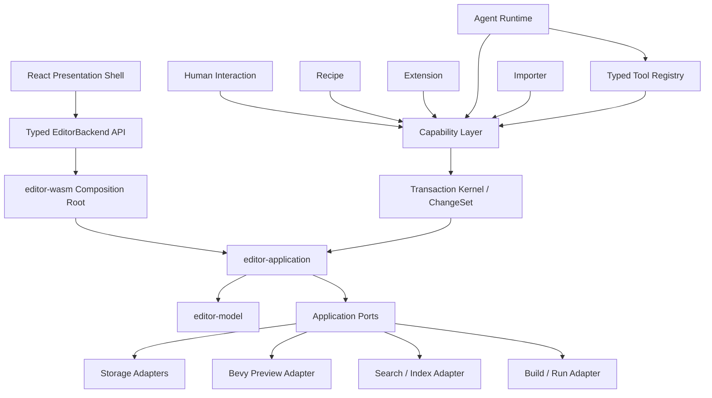

# Executive Architecture Summary

## Objective

Evolve Bevy 2D Editor from a feature-rich browser editor into **Bevy 2D Workbench**, a production-oriented 2D development environment where authoring data, runtime inspection, code, automation and AI share one semantic model and one safe mutation architecture.

## Architectural thesis

The project already owns the right primitives: stable IDs, editor documents, typed commands, operation logs, Scene Assets, overrides, validation, Logic Bricks and runtime projection. The next step is not replacing those ideas; it is **making their boundaries explicit and composable**.

## Target shape

## Fundamental boundaries

### `editor-model`
Pure domain values and invariants. No Bevy, no WASM, no browser, no network.

### `editor-application`
Use cases, commands, transaction kernel, ports, validation orchestration and `EditorSession` coordination.

### adapters
Bevy preview, storage, filesystem, OPFS, BSN, build/run, indexing and browser bridge implementations.

### frontend
Presentation, interaction and view state. It consumes typed APIs; it does not become a second domain model.

### agent runtime
A client of editor capabilities. It cannot mutate documents directly.

## Product thesis

Compete on **workflow integration**, not on engine breadth:

- world/level authoring that feels closer to LDtk/Tiled;
- reusable Bevy-aligned Scene Assets with explicit instance/override semantics;
- gameplay recipes over Logic Bricks;
- a Change Workbench that reviews human/agent/import/migration changes uniformly;
- runtime causality linking level → asset → instance → component → logic → runtime → Rust source;
- import/reimport from Aseprite, LDtk and Tiled;
- Git-friendly, text-first project data;
- AI that proposes, validates, executes and verifies through typed capabilities.

## Mandatory sequencing

Architecture hardening precedes more agent sophistication. The accepted order is:

1. architecture and CI boundaries;
2. production 2D workflow;
3. unified change/runtime workflow;
4. agent runtime and retrieval;
5. SDK/import ecosystem;
6. v1.0 stabilization.
