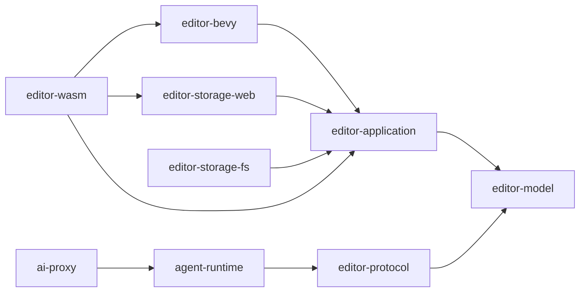

# Target Architecture

## Workspace target

```text
crates/
  editor-model/
  editor-application/
  editor-bevy/
  editor-storage-web/
  editor-storage-fs/          # optional native/desktop companion phase
  editor-wasm/
  editor-protocol/            # DTOs/tool contracts shared with proxy/agents
  agent-runtime/
  ai-proxy/

frontend/
  src/
    app/
    features/
      scene/
      assets/
      world/
      logic/
      code/
      runtime/
      changes/
      agents/
    backend/
    components/
```

The exact crate count may be introduced incrementally; the dependency direction is non-negotiable.

## Dependency rule



Forbidden:

```text
editor-model       -> bevy / wasm-bindgen / web-sys / js-sys / reqwest
editor-application -> browser APIs / React / concrete OPFS calls
agent-runtime      -> direct document internals
frontend           -> raw mutable WASM globals
```

## `editor-model`

Contains only semantic state and invariants:

- IDs and typed references;
- Scene/Asset/Instance models;
- component schemas and values;
- LogicGraph model;
- level/world model values;
- validation issue value types;
- serialization-neutral domain errors.

Serde may remain for practical DTO serialization, but JSON must not determine domain semantics.

## `editor-application`

Contains:

- `EditorSession`;
- use cases;
- typed domain commands;
- `TransactionKernel`;
- `ChangeSet`;
- operation history/checkpoints;
- approval/risk policy contracts;
- ports (`ProjectStore`, `PreviewRuntime`, `Clock`, `IdGenerator`, `SearchIndex`, etc.);
- semantic validation orchestration.

## `editor-bevy`

Contains:

- authoring → preview projection;
- Bevy entity mapping;
- play mode;
- Logic Bricks runtime execution where Bevy resources are required;
- runtime metrics/causality events;
- `RuntimeDelta` capture;
- Bevy/BSN compatibility adapters that require Bevy APIs.

It never becomes the authoritative authoring store.

## storage adapters

`editor-storage-web` implements OPFS/browser persistence. `editor-storage-fs` implements repository-native filesystem persistence when the native/companion environment is available.

Both implement the same application ports and share format/migration rules.

## `editor-wasm`

The WASM composition root owns target-specific singletons and wiring. If `thread_local!` is still necessary due to WASM/browser execution, it is confined here and contains **one `EditorSession`/container**, not domain-specific scattered globals.

## `editor-protocol`

Carries stable DTOs and capability tool contracts shared by:

- WASM/frontend;
- `ai-proxy`;
- `agent-runtime`;
- future CLI/MCP/editor extensions.

It must not expose internal storage details.

## Frontend

React owns:

- visual composition;
- transient interaction state;
- accessibility/focus;
- panel state;
- optimistic presentation where safe.

Rust/application owns:

- durable selection semantics when they affect commands;
- project state;
- mutation validity;
- IDs;
- history;
- persistence rules;
- cross-resource effects.

Feature modules consume typed capability APIs rather than `window` globals.
