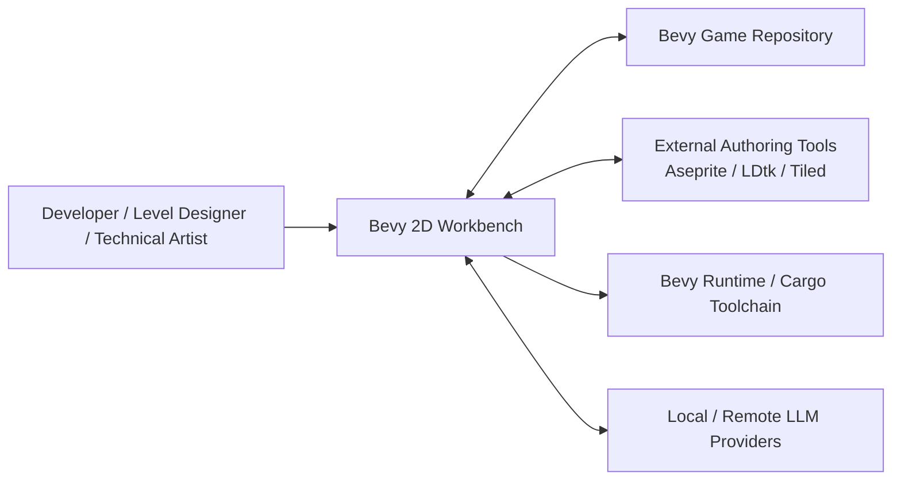
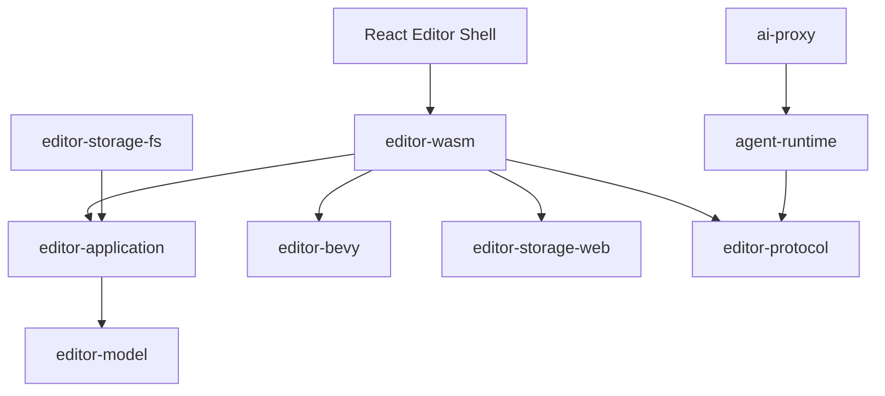
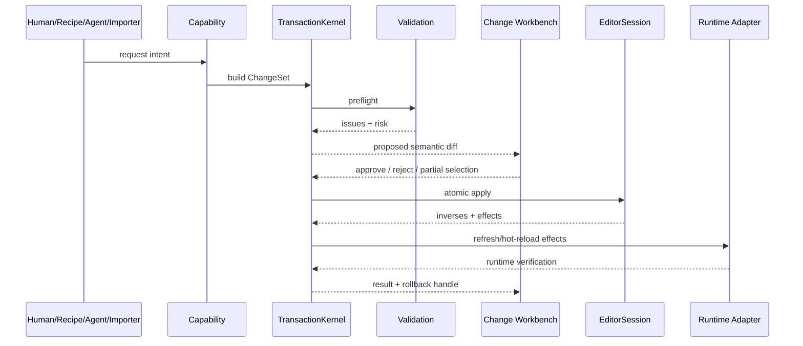
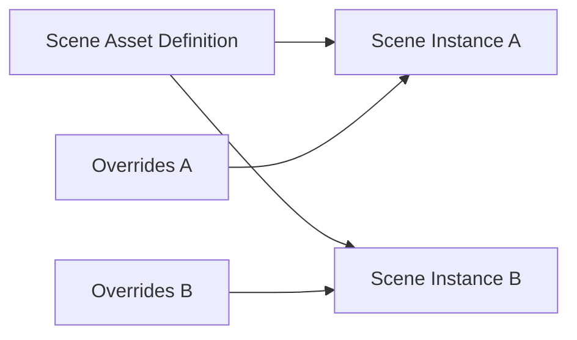
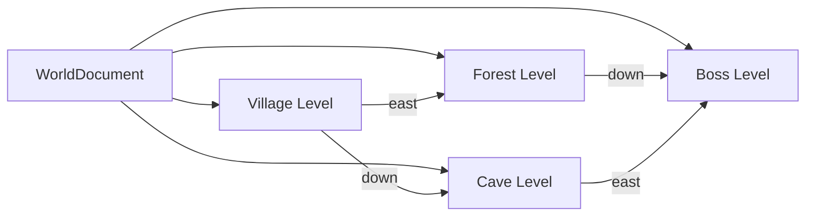
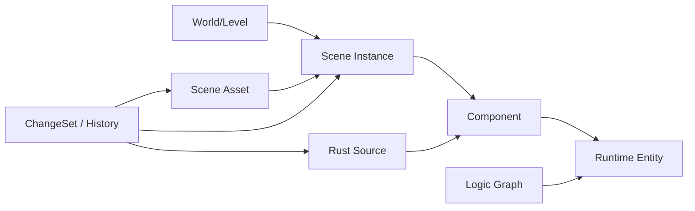
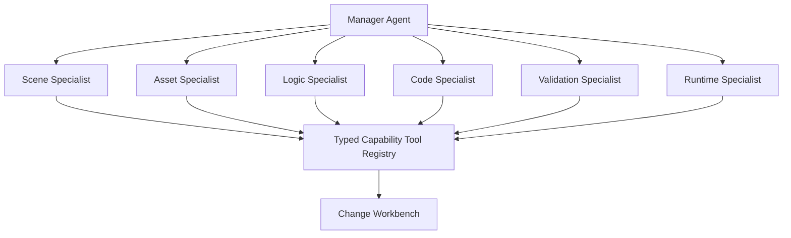

# Architecture Diagrams

## C4 — System context

## C4 — Containers

## Change flow

## Definition / Instance / Override

## World workspace

## Runtime causality graph

## Agent architecture

