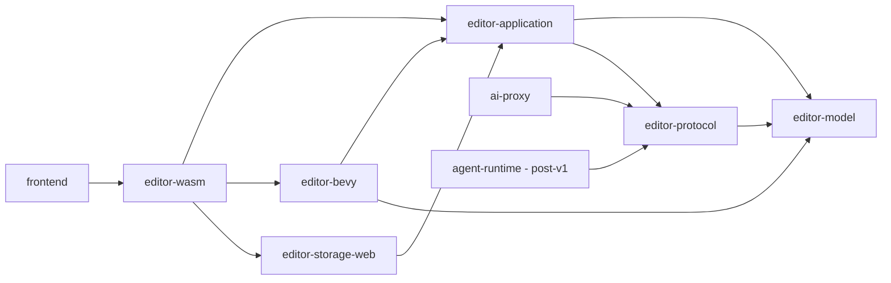

# Dependency Rules

## Grafo objetivo



## Allowed responsibility

### `editor-model`

- identities;
- domain values;
- documents;
- invariants puras;
- validation values;
- graph abstractions puras;
- serialization model where necessary.

No composition, browser, Bevy, global registries ni storage adapters.

### `editor-application`

- use cases;
- application services;
- command orchestration;
- TransactionKernel;
- EditorSession;
- ports;
- policies;
- history/checkpoints;
- typed principal/capability authorization.

No OPFS concreto, Browser API, React, wasm-bindgen exports ni `bevy::World`.

### `editor-bevy`

- authoring→runtime projection;
- Bevy entity mapping;
- preview runtime;
- runtime logic execution when needs ECS;
- Bevy diagnostics;
- BSN/Bevy compatibility adapters.

No authoritative authoring store.

### `editor-storage-web`

- implementación ProjectStore para web/OPFS;
- durability/failure mapping browser-specific.

### `editor-wasm`

- composition root;
- bindings WASM;
- target lifecycle;
- adaptación de errores/DTOs en frontera.

## Forbidden edges

CI debe fallar para:

```text
editor-model -> editor-application
editor-model -> editor-bevy
editor-model -> editor-storage-web
editor-model -> wasm-bindgen/web-sys/js-sys (except explicit temporary allowlist)
editor-application -> editor-bevy
editor-application -> editor-storage-web
editor-application -> browser APIs
editor-storage-web -> editor-bevy
frontend/components -> bridge-call/raw window wasm API
```

## Transitional allowlist

Una excepción temporal requiere:

```yaml
id: ARCH-EXCEPTION-xxx
edge: editor-application -> editor-storage-web
owner: <hito>
reason: migration compatibility
expires_when: H1.2 passes
```

La allowlist debe decrecer; añadir una excepción exige ADR o aprobación explícita del hito.

