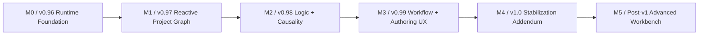

# Bevy-Native Evolution Master Roadmap

**Status:** Proposed  
**Date:** 2026-08-19  
**Relationship:** evolution/addendum after current architecture work through v0.95.

> Version labels are proposed. If release numbering changes, preserve milestone dependency order and gates.

## M0 / proposed v0.96 — Bevy-Native Runtime Foundation

Outcome: architecture is genuinely hexagonal and editor has first-class Bevy ECS execution runtime without changing persisted authoring semantics.

Must ship:
- close application -> adapter dependency leaks;
- move service/global registries out of semantic model;
- `cargo metadata` architecture fitness;
- EditorWorld foundation;
- EditorWorld/PreviewWorld identity mappings;
- typed Bevy events for semantic/runtime invalidation;
- headless runtime tests;
- typed protocol migration foundation;
- no existing workflow regression.

Exit:
- semantic hash unchanged by runtime-only rebuilds;
- no Bevy type in model/protocol persistence;
- mandatory smoke/persistence UAT green.

## M1 / v0.97 — Reactive Project Graph

Outcome: project dependencies become queryable/incremental.

Must ship:
- graph kernel;
- materialized Project Graph;
- GraphDiff/revision;
- dependents/dependencies/path;
- incremental invalidation;
- Impact Lens v1;
- first polling path replaced by notification;
- graph performance corpus.

Exit: incremental graph equals full rebuild on corpus; destructive asset operation has trustworthy impact preview.

## M2 / v0.98 — Logic Runtime + Causality

Outcome: Logic Bricks is compiled/incremental and editor explains runtime causality.

Must ship:
- Logic compiler/runtime v2;
- typed ports;
- dirty propagation/caches;
- bounded activation traces;
- FrameId/correlation;
- Why v1;
- Trace panel v1;
- system timing samples;
- UatProbePlugin v1.

Exit: no per-activation topological compilation; deterministic sensor -> controller -> actuator trace.

## M3 / v0.99 — Workflow + Production Authoring UX

Outcome: infrastructure visibly improves 2D production.

Must ship:
- World/Design/Logic/Animate/Debug/Code convergence;
- contribution registry;
- inspector decomposition;
- Scene Asset Variants v1 + provenance;
- Sprite Workspace v1;
- atlas workflow v1;
- animation clip/timeline v1;
- AutoLayer Rule Graph v1 or validated reduced scope.

Exit: common workflows require less mode hopping; destructive operations show impact; authoring UAT green.

## M4 / v1.0 — Stabilization Addendum

Outcome: architecture/workflows are release-grade.

Must ship:
- UAT runner/reporting;
- release-critical scenario catalogue;
- crash/reload recovery validation;
- migration corpus;
- accessibility gates;
- performance budgets;
- protocol compatibility policy;
- zero critical architecture exceptions;
- docs traceability gate.

Exit: small complete game can be authored, run, debugged, saved, migrated and validated through documented UAT.

## M5 / Post-v1

Candidates:
- time travel/fork/diff UI;
- richer System Graph;
- animation state/blend graph;
- graph query palette;
- advanced GraphRAG for agents;
- graph/recipe packs;
- native host expansion;
- causal performance profiler.
