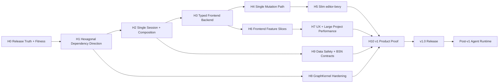

# MASTER ROADMAP — Bevy 2D Workbench

**Revision:** 2026-09 architecture/UX convergence proposal  
**Primary target:** v1.0 product contract

## Vision

Deliver a production-capable browser-first 2D Bevy authoring workbench whose strengths are:

- semantic reversible editing;
- reliable project/data workflows;
- reusable Scene Assets and overrides;
- Logic Bricks and runtime causality;
- Bevy/BSN interoperability without domain lock-in;
- typed extension/automation capabilities;
- a UI that scales to real projects;
- an architecture that can later host agents without giving them privileged mutation paths.

## Current strategic decision

The project has enough breadth for v1.0. The active program is **hardening and proving the existing product**, not expanding feature count.

The Rig/agent-native program remains parked until the v1.0 gates pass.

## Active dependency graph

Parallel work is allowed when dependencies permit; the diagram is a safety ordering, not a mandate for serial execution.

## H0 — Release Truth & Architecture Fitness

### Outcome

CI tells the truth about the architecture and baseline.

### Must ship

- repair Architecture Fitness workflow so checker actually executes;
- `cargo metadata` dependency graph gate;
- global-state ratchet;
- frontend no-direct-bridge rule;
- deterministic smoke cohort;
- release evidence manifest.

### Exit

No critical gate is “green” merely because its checker did not run.

## H1 — Hexagonal Dependency Direction

### Outcome

Dependency inversion matches the documented target.

### Must ship

- application-owned ports;
- storage-web implements ports;
- Bevy adapter depends inward;
- target composition moves to `editor-wasm`;
- remove application→storage-web and application→Bevy edges.

## H2 — Single Session & Composition Root

### Outcome

One canonical ownership model for mutable editor/application state.

### Must ship

- global state inventory;
- migrate registries from model service locators;
- migrate scene/assets/logic/runtime coordination family by family;
- one target-specific app container;
- explicit NotReady/error behavior;
- two-session isolation tests.

## H3 — Typed EditorBackend

### Outcome

React consumes typed capabilities, not raw WASM globals.

### Must ship

- `EditorBackend` contract;
- Wasm implementation;
- scene/assets/logic/runtime/validation/change capabilities migrated;
- injectable test backend;
- no new production `window as any` mutation APIs.

## H4 — Single Mutation Path

### Outcome

All normal authoring mutation semantics converge on application/TransactionKernel rules.

### Must ship

- parity characterization;
- kernel-only production dispatch;
- typed principal/capability provenance;
- removal of runtime legacy dispatch switch;
- rollback/retry behavior verified.

## H5 — Slim `editor-bevy`

### Outcome

`editor-bevy` is primarily an adapter/runtime crate.

### Must ship

Extract pure behavior where evidence supports it:

- asset use cases/commands;
- pure validation;
- pure persistence-independent transforms;
- command/history orchestration that belongs to application.

Do not split into crates mechanically; move responsibilities to existing boundaries first.

## H6 — Frontend Feature Slices & Workspace

### Outcome

New features no longer amplify central App/handler contracts.

### Must ship

- backend provider;
- scene/assets/logic/world/runtime/validation/change slices;
- App as composition root;
- document/workspace model spike;
- reduce global EditorMode branching where evidence supports it.

## H7 — UX, Accessibility & Large Project Performance

### Outcome

Core authoring workflows behave like a professional editor at declared v1 scale.

### Must ship

- indexed/virtualizable Hierarchy;
- tree-aware search;
- keyboard-accessible tree behavior;
- Inspector field-level validation/revert improvements;
- semantic design tokens completion on touched surfaces;
- 10k-entity benchmark budget;
- command/search/navigation consistency.

## H8 — GraphKernel Hardening

### Outcome

Graph abstractions have measured complexity and precise capability contracts.

### Must ship

- graph property tests;
- representative benchmarks;
- endpoint/capability contract cleanup;
- adjacency/iterator optimization only if evidence requires it.

## H9 — Data Safety & BSN Contracts

### Outcome

Supported v1 project/BSN formats and recovery behavior are evidence-backed.

### Must ship

- fault-injected ProjectStore tests;
- crash/interruption recovery UAT;
- migration corpus;
- BSN anti-corruption/IR contract tests;
- declared Bevy/BSN compatibility matrix;
- import/reimport recovery and conflict evidence.

## H10 — v1 Product Proof

### Outcome

A user can create and maintain a complete small 2D game using supported editor workflows.

### Product gates

- canonical playable project authored through UI workflows;
- save/reopen/recover tested;
- scene assets, instances, overrides and logic exercised;
- world/level workflow exercised if part of v1 promise;
- import/export/BSN supported path exercised;
- play/debug/runtime diagnostics exercised;
- keyboard critical path tested;
- performance corpus passes budgets;
- no critical architecture exceptions;
- release evidence reproducible from one commit.

## Post-v1 priority order

After the v1 release gate:

1. reassess Agent Runtime ADR against the final capability API;
2. implement a minimal manager + 1–2 specialists;
3. semantic retrieval;
4. Agent Workbench using existing ChangeSet review;
5. runtime-aware diagnostics;
6. background automation only after cancellation/recovery policy is proven.

